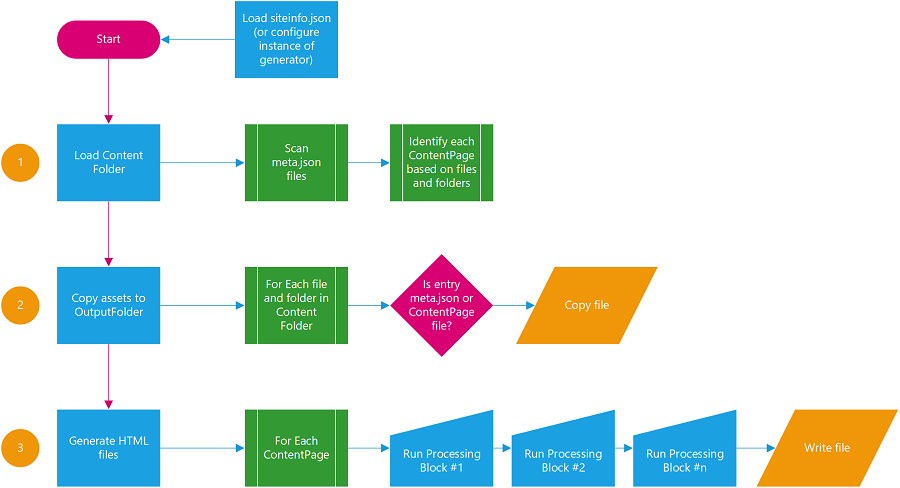

### Markdown Page Generator


**MDPGen** is a set of tools to generate static HTML sites based on Markdown. It can be used as-is, or customized to provide extensions both within the Markdown and the generation of the site itself.

## Contents
- [Building the tools](./docs/building.md)
- [Running the tools](./docs/running-the-tools.md)
- [Defining a site](./docs/defining-a-site.md)
- [Markdown Syntax](./docs/markdown-syntax.md)
- [Customizing Extensions](./docs/customization.md)

## Configuration
To build a site, MDPGen must be configured with some basic information, primarily where the source content is located, and where the output should be placed. This configuration is most often done with a _site configuration_ `.json` file when using the pre-supplied command line tools; see the documentation on the [site configuration file](./docs/defining-a-site.md). 

Alternatively, if you are using the class library directly in your own code, you can set properties on the underlying `StaticSiteGenerator` class and then call `Initialize` to connect everything together. For example:

```csharp
var siteGenerator = new StaticSiteGenerator
{
    CopyAssets = true,
    MaxThreads = 1,
    DefaultPageTemplate = "BlogPost.cshtml",
    SearchFolders = new List<string>() { @"C:\Site\Include" },
    ContentFolder = @"C:\Site\ContentFolder",
    ProgressCallback = (current,max) => Console.WriteLine($"Finished {current} of {max} pages."),
};

// Initialize the library
siteGenerator.Initialize();

// Build the site in "C:\Site\Output"
siteGenerator.BuildSize(@"C:\Site\Output", CancellationToken.None);
```

## Architecture
MDPGen builds a site with three basic steps. 

1. Copy asset files from the source folder to the destination folder. This is a recursive copy that walks the entire folder structure and duplicates it in the output folder. Files internally used by the tools are ignored. As part of the copy process, the tooling will automatically do conversions from SCSS to CSS.
2. Identify and load the source content files. This step involves walking the source folder and looking at `metadata` files (by default these are named `meta.json`) and loading each file/folder that is identifed. The source files can be HTML (`.html`, `.htm`, or `.aspx`) or Markdown (`.md`). Each file is represented by a `ContentPage`.
3. Running the build pipeline. This step takes each `ContentPage` from step #2 and processes it to turn it into the final HTML output file. It is copied into the output folder.


