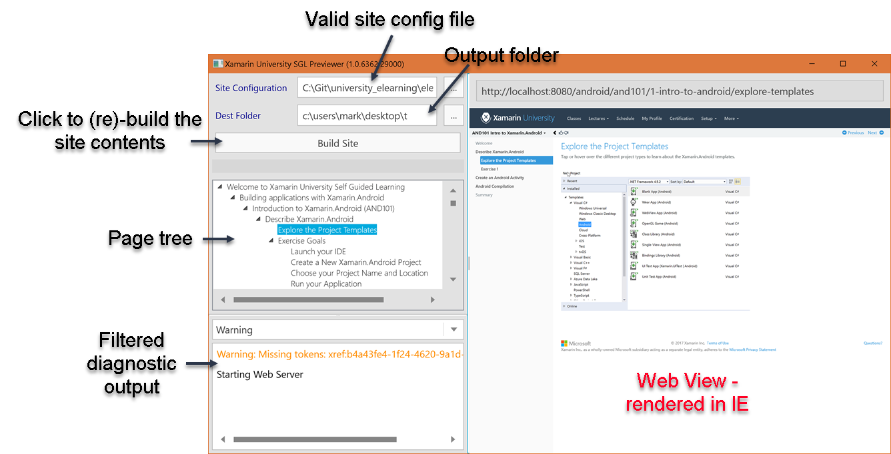
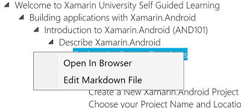

You will need the latest [SGL binary distribution zip file: **sgl-bin.zip**](https://aka.ms/xamu-sgl-tools). Download it and unzip it in a known location. It contains two tools:

| Tool | Description |
|------|-------------|
| **MDPGen** | A .NET Core command line tool which runs on Windows, macOS, and Ubuntu. Note that you need [.NET Core installed](https://www.microsoft.com/net/core#windowsvs2015) to use this. |
| **SGLMonitor** | A WPF application which provides a GUI around the command line shell. |

### MDPGen

The Markdown Page Generator is a command line tool which takes our SGL site structure and generates a website from it. It can be run on several platforms and has several useful options:

```
MDPGen 2.0.6416.25157
Copyright (C)  2017 Xamarin University

  -i, --Initialize           Initialize a new site.

  -s, --SiteConfiguration    Site configuration file.

  -m, --MaxThreads           # of Threads to use during processing (defaults to # of logical CPUs)

  -o, --OutputFolder         Folder to generate site into (defaults to ".\output"

  -v, --Verbose              Verbose output

  --help                     Display this help screen.

  --version                  Display version information.
```

The only mandatory option is **-s** which is used to specify the _site configuration file_. You can also add **-o** to indicate the location to place all the output - by default it places it into the current folder under an **Output** sub-folder. Here's an example command line to build the site:

```
C:> MDPGen -s "C:\Users\Mark\Documents\el\dev-siteinfo.json" -o c:\Users\Mark\Desktop\output
```

This would read the contents of `C:\Users\Mark\Documents\el\dev-siteinfo.json`, generate all the HTML content specified by this file and place it all into the `c:\Users\Mark\Desktop\output` folder.

> Warning: all existing content in the given folder will be deleted. The folder will be created if it doesn't exist already.

### SGLMonitor

**SGLMonitor** is a WPF application which runs under Windows and provides the same basic options as the command line tool - except it also embeds a browser so you can explore the generated site right in the application. 

Once you generate a site, this application will spin up a local web browser on `http://localhost:8080`. While the application is running, **SGLMonitor** will monitor the source input files (identified through the site configuration files). If any of these files are _changed_, it will automatically generate the HTML from the source file and copy the result over to the output folder. It will also copy asset files over automatically if they are changed. This allows you to _edit_ source files in place and see the changes immediately.

Here are the main features of the application.



To use the application, first specify the _site configuration file_ in the first entry field, then specify the _output_ folder for the generated content in the second field. Finally, click the button to generate the site and start the web server. You can click on the tree nodes to select a specific page to preview right in the app.

You can interactively explore the generated website through this application, clicking on items in the Tree List will change the Web Browser page. If you use the browser area to navigate to a new page, the WPF app will keep the tree synchronized. In addition, you can right-click on nodes in the tree to get to other context options:



Selecting **Open in Browser** will spin up your _default_ web browser application with the given page. The **Edit Markdown File** option will open your default Markdown editor for the given source file that provides the data for that node.

#### Running or debugging SGLMonitor (SGL Previewer) from source

If you run into this error while running/debugging the GUI previewer from Visual Studio, you will need to do a full solution rebuild before debugging.

> Could not load file or assembly 'XamU.SGL.Extensions' or one of its dependencies. The system cannot find the file specified.

Some of the runtime dependencies for running the previewer are set up in a post-build action, simply running the SGLMonitor project directly will not set those dependencies up for runtime use.
